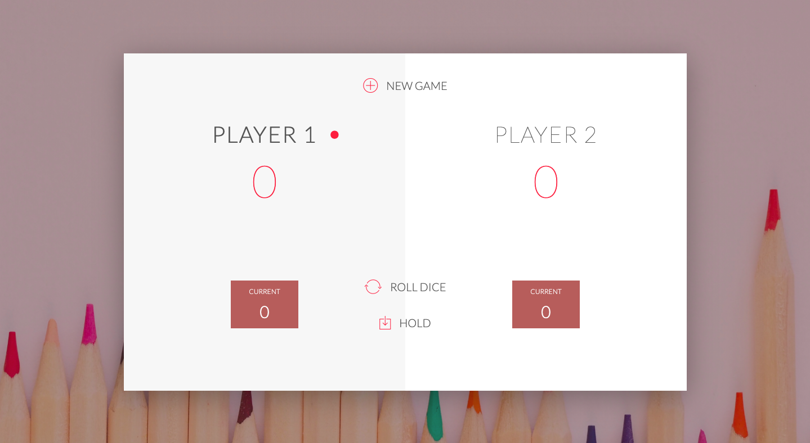

# pigdice50
A simple web dice game implemented in JavaScript, two players roll dice in turn until a player wins, with a score exceeding 50. 

Link to game description: https://en.wikipedia.org/wiki/Pig_(dice_game)

Screen shot of the display:

Note that this game was forked from jonasschmedtmann/complete-javascript-course.

